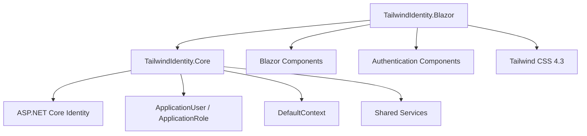
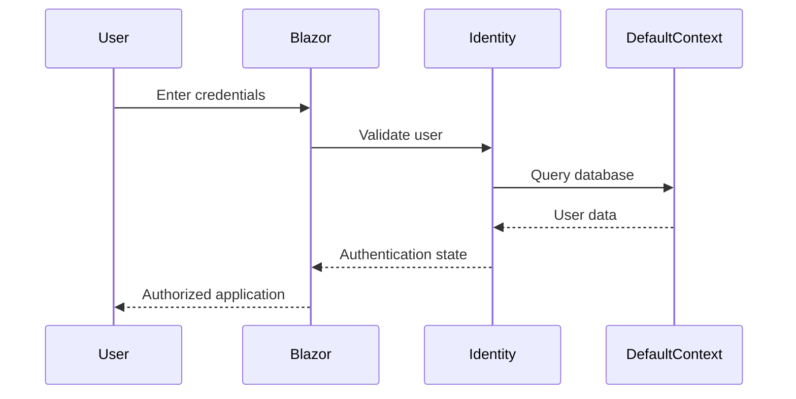

# TailwindIdentity.Blazor


# Overview

`TailwindIdentity.Blazor` is an ASP.NET Core Blazor starter template built with:

* ASP.NET Core 8 / 9 / 10
* Blazor
* Tailwind CSS 4.3
* ASP.NET Core Identity
* Entity Framework Core
* Shared authentication infrastructure from `TailwindIdentity.Core`

This project demonstrates how to integrate ASP.NET Core Identity with a modern Blazor application while keeping authentication, persistence, and business models centralized.

---

# Architecture



---

# Features

## Authentication

Provides a complete Identity workflow:

* Login
* Register
* Logout
* Forgot password
* Reset password
* Profile management
* Password change
* User authentication state

---

# Blazor Identity Integration

The project separates authentication responsibilities:

```text id="7v5rqd"
TailwindIdentity.Blazor

├── Components/
│   └── Account/
│       ├── Login
│       ├── Register
│       ├── Manage
│       └── Logout
│
├── Services/
│   └── Authentication services
│
└── Shared/
```

---

# Authentication Flow



---

# Shared Core Reference

This project uses:

```text id="f1n7yh"
TailwindIdentity.Core
```

Provides:

* ApplicationUser
* ApplicationRole
* DefaultContext
* Entity Framework Core configuration
* MailKit email service
* Shared models

Reference:

```xml id="g4l2cw"
<ProjectReference Include="..\TailwindIdentity.Core\TailwindIdentity.Core.csproj" />
```

---

# Project Structure

```text id="m0c6pk"
TailwindIdentity.Blazor/

├── Components/
│   ├── Layout/
│   ├── Pages/
│   └── Account/
│
├── Services/
│
├── wwwroot/
│   ├── css/
│   └── js/
│
├── Program.cs
├── appsettings.json
└── TailwindIdentity.Blazor.csproj
```

---

# Custom Identity UI

Authentication components are styled with Tailwind CSS.

Included components:

| Component      | Purpose             |
| -------------- | ------------------- |
| Login          | User authentication |
| Register       | Account creation    |
| ForgotPassword | Password recovery   |
| Profile        | User information    |
| ChangePassword | Password update     |

---

# Tailwind CSS Pipeline

Frontend technologies:

* Tailwind CSS 4.3
* PostCSS
* esbuild

Install dependencies:

```bash id="3v6hkc"
npm install
```

Development mode:

```bash id="2v0h7f"
npm run dev
```

Production build:

```bash id="7s4w2d"
npm run build
```

Output:

```text id="d8o5qx"
wwwroot/

└── css/
    └── app.css
```

---

# Database Setup

Database management is handled by:

```text id="8s1q4r"
TailwindIdentity.Core
```

Apply migrations:

```bash id="h1n4eq"
dotnet ef database update \
-p ../TailwindIdentity.Core \
-s .
```

Connection example:

```json id="0i7m6a"
{
  "ConnectionStrings": {
    "DefaultConnection":
    "Server=localhost;Database=TailwindIdentity;Trusted_Connection=True;TrustServerCertificate=True"
  }
}
```

---

# Run Application

Restore packages:

```bash id="5s9j4e"
dotnet restore
```

Start Tailwind watcher:

```bash id="k8q3vz"
npm run dev
```

Run application:

```bash id="6j7w2c"
dotnet run
```

---

# Screenshots

Recommended screenshots:

```text id="4n8x0c"
docs/images/

├── blazor-login.png
├── blazor-register.png
└── blazor-dashboard.png
```

Example:


---

# Technology Stack

| Technology            | Usage           |
| --------------------- | --------------- |
| ASP.NET Core Blazor   | Application UI  |
| Razor Components      | UI components   |
| Tailwind CSS          | Styling         |
| Entity Framework Core | Database access |
| ASP.NET Core Identity | Authentication  |
| MailKit               | Email services  |

---

# Related Projects

| Project                | Description                    |
| ---------------------- | ------------------------------ |
| TailwindIdentity.Core  | Shared Identity infrastructure |
| TailwindIdentity.Razor | Razor Pages template           |
| TailwindIdentity.Mvc   | MVC template                   |
| TailwindIdentity.Maui  | MAUI Hybrid template           |

---

# License

MIT License
