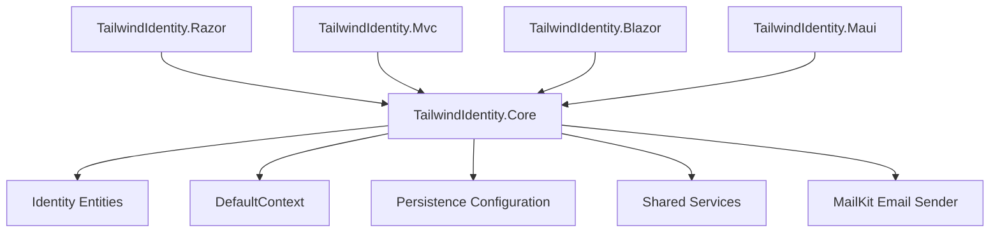

Je commence par **`TailwindIdentity.Core/README.md`**.

# TailwindIdentity.Core


## Overview

`TailwindIdentity.Core` is the shared infrastructure library used by all TailwindIdentity application templates.

It centralizes authentication, persistence, identity models, and common services to provide a single reusable foundation across:

* ASP.NET Core Razor Pages
* ASP.NET Core MVC
* ASP.NET Core Blazor
* .NET MAUI Blazor Hybrid

The goal is to keep Identity configuration and database access consistent across all applications.

---

## Architecture



---

# Features

## ASP.NET Core Identity

Provides:

* Custom `ApplicationUser`
* Custom `ApplicationRole`
* Identity configuration
* User management
* Role management
* Password policies
* Authentication configuration

---

## Entity Framework Core

Contains the shared database layer:

* `DefaultContext`
* Entity configurations
* Migrations
* SQL Server support

Example:

```csharp
public class DefaultContext : IdentityDbContext<ApplicationUser>
{
    public DefaultContext(
        DbContextOptions<DefaultContext> options)
        : base(options)
    {
    }
}
```

---

# Project Structure

```
TailwindIdentity.Core/

├── Entities/
│   ├── ApplicationUser.cs
│   └── ApplicationRole.cs
│
├── Data/
│   └── DefaultContext.cs
│
├── Persistence/
│   └── Entity configurations
│
├── Services/
│   └── MailKitEmailSender.cs
│
├── Migrations/
│
└── TailwindIdentity.Core.csproj
```

---

# Dependencies

Main packages:

```xml
<PackageReference Include="Microsoft.AspNetCore.Identity.EntityFrameworkCore" />

<PackageReference Include="Microsoft.EntityFrameworkCore.SqlServer" />

<PackageReference Include="MailKit" />
```

---

# Database Configuration

All applications use the same connection string.

Example:

```json
{
  "ConnectionStrings": {
    "DefaultConnection": 
    "Server=localhost;Database=TailwindIdentity;Trusted_Connection=True;TrustServerCertificate=True"
  }
}
```

---

# Entity Framework Commands

Create database:

```bash
dotnet ef database update \
-p TailwindIdentity.Core \
-s TailwindIdentity.Razor
```

Create a migration:

```bash
dotnet ef migrations add InitialCreate \
-p TailwindIdentity.Core \
-s TailwindIdentity.Razor
```

---

# MailKit Configuration

The shared email service supports Identity emails:

* Account confirmation
* Password reset
* Security notifications

Configuration:

```json
{
  "Email": {
    "From": "noreply@domain.com",
    "SmtpHost": "smtp.domain.com",
    "SmtpPort": "587",
    "SmtpUser": "username",
    "SmtpPassword": "password"
  }
}
```

---

# Used By

This library is referenced by:

| Project                 | Technology               |
| ----------------------- | ------------------------ |
| TailwindIdentity.Razor  | ASP.NET Core Razor Pages |
| TailwindIdentity.Mvc    | ASP.NET Core MVC         |
| TailwindIdentity.Blazor | ASP.NET Core Blazor      |
| TailwindIdentity.Maui   | .NET MAUI Blazor Hybrid  |

---

# Design Goals

* One Identity implementation
* Shared database model
* Reusable authentication infrastructure
* Clean separation between UI and backend
* Easy migration between application types

---

# License

MIT License

Je continue ensuite avec **`TailwindIdentity.Razor/README.md`**, puis MVC, Blazor et MAUI en gardant exactement la même charte.
