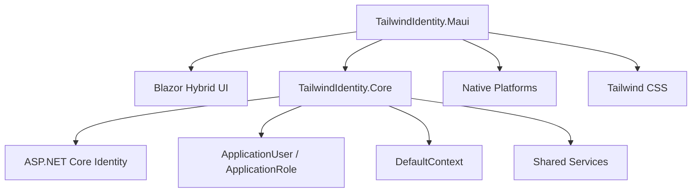

# TailwindIdentity.Maui


# Overview

`TailwindIdentity.Maui` is a modern **.NET MAUI Blazor Hybrid** starter application built with:

* .NET 8 / 9 / 10
* .NET MAUI
* Blazor Hybrid
* Tailwind CSS 4.3
* ASP.NET Core Identity shared infrastructure
* Entity Framework Core
* `TailwindIdentity.Core`

This project demonstrates how to reuse the same Identity foundation across Web applications and native desktop/mobile applications.

---

# Architecture



---

# Features

## Cross-platform Application

Supports:

* Windows
* Android
* iOS
* MacCatalyst

---

## Authentication

Uses the same Identity infrastructure as the Web templates:

* Login
* Register
* Logout
* Password recovery
* Profile management
* Change password
* User authentication state

---

# Shared Identity Architecture

The application reuses:

```text id="n3a7xz"
TailwindIdentity.Core
```

Shared components:

* ApplicationUser
* ApplicationRole
* DefaultContext
* Entity configurations
* Persistence layer
* MailKit email service

This allows the same authentication model across:

```text id="8y7q2m"
                TailwindIdentity.Core

                       ▲

       ┌───────────────┼───────────────┐
       │               │               │
    Razor            MVC          Blazor
                                       │
                                       ▼
                                MAUI Hybrid
```

---

# Blazor Hybrid UI

The user interface is built with Blazor components running inside a native MAUI application.

Structure:

```text id="v6r2qd"
TailwindIdentity.Maui/

├── Components/
│   ├── Pages/
│   ├── Layout/
│   └── Account/
│
├── wwwroot/
│   ├── css/
│   └── js/
│
├── Platforms/
│   ├── Android/
│   ├── iOS/
│   ├── MacCatalyst/
│   └── Windows/
│
├── MauiProgram.cs
└── TailwindIdentity.Maui.csproj
```

---

# Native Platform Configuration

Platform-specific configuration is isolated:

| Platform    | Folder                  |
| ----------- | ----------------------- |
| Android     | `Platforms/Android`     |
| iOS         | `Platforms/iOS`         |
| MacCatalyst | `Platforms/MacCatalyst` |
| Windows     | `Platforms/Windows`     |

---

# Tailwind CSS Integration

Frontend pipeline:

* Tailwind CSS 4.3
* PostCSS
* esbuild

Install dependencies:

```bash id="p9k4zs"
npm install
```

Development:

```bash id="q7m2vx"
npm run dev
```

Production:

```bash id="r4n8ky"
npm run build
```

Generated assets:

```text id="w2m8cz"
wwwroot/

└── css/
    └── app.css
```

---

# Database Configuration

Database access is provided by:

```text id="4z9qxe"
TailwindIdentity.Core
```

Apply migrations:

```bash id="e6f3kw"
dotnet ef database update \
-p ../TailwindIdentity.Core \
-s .
```

Connection example:

```json id="3x8q7p"
{
  "ConnectionStrings": {
    "DefaultConnection":
    "Server=localhost;Database=TailwindIdentity;Trusted_Connection=True;TrustServerCertificate=True"
  }
}
```

---

# Build Requirements

Required tools:

* .NET SDK 8+
* Visual Studio 2022
* .NET MAUI workload
* Android SDK (Android development)
* Xcode (iOS/macOS development)

Install MAUI workload:

```bash id="r8m4tz"
dotnet workload install maui
```

---

# Run Application

Restore packages:

```bash id="s2v9km"
dotnet restore
```

Build:

```bash id="j5x8qd"
dotnet build
```

Run:

```bash id="u3k7pm"
dotnet run
```

---

# Screenshots

Recommended screenshots:

```text id="h9q2ls"
docs/images/

├── maui-login.png
├── maui-home.png
└── maui-profile.png
```

Example:


---

# Technology Stack

| Technology            | Usage                        |
| --------------------- | ---------------------------- |
| .NET MAUI             | Native application framework |
| Blazor Hybrid         | UI layer                     |
| Tailwind CSS          | Styling                      |
| ASP.NET Core Identity | Authentication               |
| Entity Framework Core | Data access                  |
| MailKit               | Email services               |

---

# Related Projects

| Project                 | Description                    |
| ----------------------- | ------------------------------ |
| TailwindIdentity.Core   | Shared Identity infrastructure |
| TailwindIdentity.Razor  | Razor Pages template           |
| TailwindIdentity.Mvc    | MVC template                   |
| TailwindIdentity.Blazor | Blazor template                |

---

# License

MIT License
