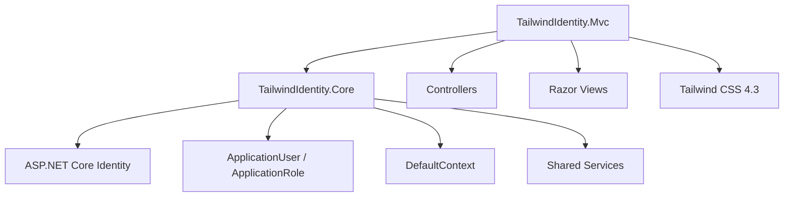

# TailwindIdentity.Mvc


# Overview

`TailwindIdentity.Mvc` is an ASP.NET Core MVC starter template built with:

* ASP.NET Core 8 / 9 / 10
* MVC Architecture
* Tailwind CSS 4.3
* ASP.NET Core Identity
* Entity Framework Core
* Shared authentication infrastructure from `TailwindIdentity.Core`

This project provides a clean MVC foundation with a fully customized Identity interface powered by Tailwind CSS.

---

# Architecture



---

# Features

## Authentication

The template includes a complete Identity workflow:

* User registration
* User login
* Logout
* Password recovery
* Profile management
* Password change
* Email confirmation support

---

# Custom Identity UI

The default Bootstrap Identity pages are replaced with Tailwind CSS views.

Included screens:

| Feature         | Location                              |
| --------------- | ------------------------------------- |
| Login           | `Views/Account/Login.cshtml`          |
| Register        | `Views/Account/Register.cshtml`       |
| Forgot Password | `Views/Account/ForgotPassword.cshtml` |
| Profile         | `Views/Manage/Profile.cshtml`         |
| Change Password | `Views/Manage/ChangePassword.cshtml`  |

---

# MVC Architecture

The application follows the standard ASP.NET Core MVC pattern:

```text
TailwindIdentity.Mvc

├── Controllers/
│   ├── AccountController.cs
│   └── ManageController.cs
│
├── Views/
│   ├── Account/
│   ├── Manage/
│   └── Shared/
│
├── Models/
│
├── wwwroot/
│
├── Program.cs
└── appsettings.json
```

---

# Shared Core Reference

The project depends on:

```text
TailwindIdentity.Core
```

It provides:

* ApplicationUser
* ApplicationRole
* DefaultContext
* Entity Framework configuration
* MailKit email sender
* Shared services

Reference:

```xml
<ProjectReference Include="..\TailwindIdentity.Core\TailwindIdentity.Core.csproj" />
```

---

# Controllers

Main controllers:

## AccountController

Handles:

* Login
* Register
* Logout
* Password recovery

Example:

```csharp
public class AccountController : Controller
{
    public IActionResult Login()
    {
        return View();
    }
}
```

---

## ManageController

Handles:

* User profile
* Account settings
* Password changes

---

# Tailwind CSS Pipeline

Frontend stack:

* Tailwind CSS 4.3
* PostCSS
* esbuild

Install:

```bash
npm install
```

Development:

```bash
npm run dev
```

Production:

```bash
npm run build
```

Generated assets:

```text
wwwroot/

├── css/
│   └── app.css
│
└── js/
    └── app.js
```

---

# Database Configuration

The project uses Entity Framework Core through `TailwindIdentity.Core`.

Update database:

```bash
dotnet ef database update \
-p ../TailwindIdentity.Core \
-s .
```

Example connection:

```json
{
  "ConnectionStrings": {
    "DefaultConnection":
    "Server=localhost;Database=TailwindIdentity;Trusted_Connection=True;TrustServerCertificate=True"
  }
}
```

---

# Run Application

Restore dependencies:

```bash
dotnet restore
```

Start frontend build:

```bash
npm run dev
```

Launch application:

```bash
dotnet run
```

---

# Screenshots

Recommended screenshots:

```text
docs/images/

├── mvc-login.png
├── mvc-register.png
└── mvc-profile.png
```

Example:


---

# Technology Stack

| Technology            | Usage          |
| --------------------- | -------------- |
| ASP.NET Core MVC      | Web framework  |
| Razor Views           | UI rendering   |
| Tailwind CSS          | Styling        |
| Entity Framework Core | Data access    |
| ASP.NET Core Identity | Authentication |
| MailKit               | Email delivery |

---

# Related Projects

| Project                 | Description                    |
| ----------------------- | ------------------------------ |
| TailwindIdentity.Core   | Shared Identity infrastructure |
| TailwindIdentity.Razor  | Razor Pages template           |
| TailwindIdentity.Blazor | Blazor template                |
| TailwindIdentity.Maui   | MAUI Hybrid template           |

---

# License

MIT License
