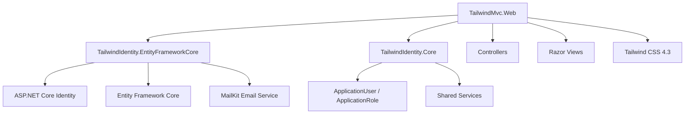

# TailwindMvc.Web


# Overview

`TailwindMvc.Web` is a modern ASP.NET Core MVC application built with:

* ASP.NET Core 8
* MVC Architecture (Controllers + Razor Views)
* Tailwind CSS 4.3 (with PostCSS)
* Entity Framework Core 8 (via `TailwindIdentity.EntityFrameworkCore`)
* ASP.NET Core Identity
* MailKit for email services (configured, commented in Program.cs)

This project provides a complete MVC starter template with custom Identity controllers/views and legal pages.

---

# Architecture



---

# Features

## Authentication (AccountController)

Complete Identity workflow with controllers:

* Login (`GET/POST /Account/Login`)
* Register (`GET/POST /Account/Register`)
* Forgot Password (`GET/POST /Account/ForgotPassword`)
* Forgot Password Confirmation (`/Account/ForgotPasswordConfirmation`)
* Email Confirmation (`/Account/ConfirmEmail`)
* Logout (`POST /Account/Logout`)
* Access Denied (`/Account/AccessDenied`)

## Account Management (ManageController)

* Profile (`GET/POST /Manage/Index`)
* Change Password (`GET/POST /Manage/ChangePassword`)

## Legal Pages (LegalController)

Static legal content:

* Conditions Générales d'Utilisation (`/Legal/CGU`)
* Conditions Générales de Vente (`/Legal/CGV`)
* Politique de Confidentialité (`/Legal/Confidentiality`)
* RGPD (`/Legal/RGPD`)

## UI & Styling

* Responsive layout with Tailwind CSS 4.3
* Clean authentication forms
* Modern form components with validation
* Mobile-friendly interface

---

# Project Structure

```
TailwindMvc.Web/

├── Controllers/
│   ├── AccountController.cs     # Auth: Login, Register, ForgotPassword, Logout, ConfirmEmail
│   ├── HomeController.cs        # Home & Privacy
│   ├── LegalController.cs       # Legal pages (CGU, CGV, Confidentiality, RGPD)
│   └── ManageController.cs      # Profile & ChangePassword
├── Models/
│   └── ErrorViewModel.cs
├── Views/
│   ├── Account/
│   │   ├── Login.cshtml
│   │   ├── Register.cshtml
│   │   ├── ForgotPassword.cshtml
│   │   ├── ForgotPasswordConfirmation.cshtml
│   │   ├── ConfirmEmail.cshtml
│   │   └── AccessDenied.cshtml
│   ├── Home/
│   │   ├── Index.cshtml
│   │   └── Privacy.cshtml
│   ├── Legal/
│   │   ├── CGU.cshtml
│   │   ├── CGV.cshtml
│   │   ├── Confidentiality.cshtml
│   │   └── RGPD.cshtml
│   ├── Manage/
│   │   ├── Index.cshtml
│   │   └── ChangePassword.cshtml
│   ├── Shared/
│   │   ├── _Layout.cshtml
│   │   ├── _LoginPartial.cshtml
│   │   └── _ValidationScriptsPartial.cshtml
│   ├── _ViewImports.cshtml
│   └── _ViewStart.cshtml
├── wwwroot/
│   ├── css/
│   │   ├── app.css              # Tailwind source
│   │   └── style.css            # Compiled output
│   └── favicon.ico
├── Program.cs
├── appsettings.json
├── appsettings.Development.json
├── package.json
├── package-lock.json
├── postcss.config.js
├── TailwindMvc.Web.csproj
└── PROSS.md
```

---

# Dependencies

## NuGet Packages (from csproj)

| Package | Version | Purpose |
|---------|---------|---------|
| `Microsoft.EntityFrameworkCore.Design` | 8.0.29 | EF Core design-time tools |

## Project References

```xml
<ProjectReference Include="..\TailwindIdentity.EntityFrameworkCore\TailwindIdentity.EntityFrameworkCore.csproj" />
```

The `TailwindIdentity.EntityFrameworkCore` project references `TailwindIdentity.Core` and provides:
* `AddTailwindIdentity()` extension method
* Identity entities (`ApplicationUser`, `ApplicationRole`)
* EF Core context and migrations
* MailKit email sender

## npm Dev Dependencies

| Package | Version | Purpose |
|---------|---------|---------|
| `@tailwindcss/cli` | ^4.3.3 | Tailwind CLI |
| `@tailwindcss/postcss` | ^4.3.3 | PostCSS plugin |
| `postcss` | ^8.5.23 | PostCSS |
| `postcss-cli` | ^11.0.1 | PostCSS CLI |
| `autoprefixer` | ^10.5.4 | CSS vendor prefixes |
| `esbuild` | ^0.28.1 | JS bundler |
| `lucide` | ^1.25.0 | Icon library |

---

# Tailwind CSS Pipeline

The frontend uses:

* Tailwind CSS 4.3 (native CSS variables, no config file needed)
* PostCSS for processing
* esbuild for JavaScript bundling

## Install Dependencies

```bash
npm install
```

## Development Mode (Watch)

```bash
npm run dev
```

Runs `postcss` in watch mode:
```
postcss wwwroot/css/app.css -o wwwroot/css/style.css --watch
```

## Production Build

```bash
npm run build
```

Compiles (non-minified):
```
postcss wwwroot/css/app.css -o wwwroot/css/style.css
```

## Minified Production Build

```bash
npm run css:build
```

Uses Tailwind CLI with minification:
```
npx @tailwindcss/cli -i ./wwwroot/css/app.css -o ./wwwroot/css/style.css --minify
```

## JavaScript Bundling

```bash
npm run build:js
```

Bundles icons:
```
esbuild wwwroot/js/icons.js --bundle --outfile=wwwroot/js/icons.bundle.js
```

## Generated Files

```
wwwroot/
└── css/
    ├── app.css      # Source (Tailwind directives)
    └── style.css    # Compiled output (referenced in _Layout.cshtml)
```

The `Tailwind` MSBuild target in the `.csproj` runs `npm run css:build` before each .NET build.

---

# Database Setup

## Connection String

Default in `appsettings.json` (currently minimal - add your connection string):

```json
{
  "ConnectionStrings": {
    "DefaultConnection": "Server=localhost;Database=TailwindIdentity;Trusted_Connection=True;Encrypt=true;MultipleActiveResultSets=true;TrustServerCertificate=true"
  }
}
```

## Apply Migrations

Migrations are in `TailwindIdentity.EntityFrameworkCore/Migrations/`.

```bash
dotnet ef database update \
  -p ../TailwindIdentity.EntityFrameworkCore \
  -s .
```

## Create a Migration

```bash
dotnet ef migrations add MigrationName \
  -p ../TailwindIdentity.EntityFrameworkCore \
  -s .
```

---

# Run Application

## Prerequisites

* .NET 8 SDK
* Node.js 18+ (for Tailwind CSS)
* SQL Server LocalDB or SQL Server instance

## Steps

1. **Restore .NET packages:**

```bash
dotnet restore
```

2. **Install npm dependencies:**

```bash
npm install
```

3. **Build CSS (one-time, minified for production):**

```bash
npm run css:build
```

4. **Run database migrations:**

```bash
dotnet ef database update -p ../TailwindIdentity.EntityFrameworkCore -s .
```

5. **Start development:**

```bash
# Terminal 1 - CSS watch mode (optional)
npm run dev

# Terminal 2 - Run application
dotnet run
```

The application will be available at `https://localhost:5001` (or the configured port).

---

# Configuration

## appsettings.json

Currently minimal - add these sections as needed:

| Section | Description |
|---------|-------------|
| `ConnectionStrings.DefaultConnection` | SQL Server connection |
| `Email` | SMTP settings for MailKit (From, SmtpHost, SmtpPort, SmtpUser, SmtpPassword) |
| `Identity.RequireConfirmedEmail` | Require email confirmation for sign-in |
| `Logging` | Log levels |

## Program.cs Highlights

* Uses `AddControllersWithViews()` for MVC
* Uses `AddTailwindIdentity()` extension from `TailwindIdentity.EntityFrameworkCore`
* Configures authentication/authorization middleware
* Maps default controller route: `{controller=Home}/{action=Index}/{id?}`

---

# Screenshots

Add screenshots to `docs/images/`:

```
docs/images/
├── mvc-login.png
├── mvc-register.png
├── mvc-profile.png
└── mvc-legal.png
```

Example usage:

```markdown

```

---

# Technology Stack

| Technology | Usage |
|------------|-------|
| ASP.NET Core 8 | Web framework |
| MVC | Architecture (Controllers + Views) |
| Razor Views | UI rendering |
| Tailwind CSS 4.3 | Styling (native CSS variables) |
| PostCSS | CSS processing |
| esbuild | JavaScript bundling |
| Entity Framework Core 8 | Database access (via EntityFrameworkCore project) |
| ASP.NET Core Identity | Authentication |
| MailKit | Email services (available, commented in Program.cs) |

---

# Related Projects

| Project | Description |
|---------|-------------|
| `TailwindIdentity.Core` | Shared Identity entities & services |
| `TailwindIdentity.EntityFrameworkCore` | EF Core Identity implementation |
| `TailwindRazorPage.Web` | Razor Pages template |
| `TailwindBlazor.Web` | Blazor template |
| `TailwindMaui.Web` | MAUI Hybrid template |

---

# License

MIT License