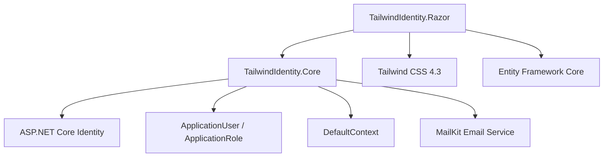

# TailwindIdentity.Razor


# Overview

`TailwindIdentity.Razor` is an ASP.NET Core Razor Pages starter template built with:

* ASP.NET Core 8 / 9 / 10
* Razor Pages
* Tailwind CSS 4.3
* ASP.NET Core Identity
* Entity Framework Core
* Shared authentication infrastructure from `TailwindIdentity.Core`

This project provides a modern Razor Pages foundation with a fully customized Identity UI replacing the default Bootstrap-based templates.

---

# Architecture



---

# Features

## Authentication

Includes a complete custom Identity experience:

* Login
* Register
* Forgot password
* Reset password
* Profile management
* Change password
* Logout

---

## Custom Identity UI

All Identity pages are redesigned with Tailwind CSS.

Included pages:

| Page            | Route                                     |
| --------------- | ----------------------------------------- |
| Login           | `/Identity/Account/Login`                 |
| Register        | `/Identity/Account/Register`              |
| Forgot Password | `/Identity/Account/ForgotPassword`        |
| Profile         | `/Identity/Account/Manage`                |
| Change Password | `/Identity/Account/Manage/ChangePassword` |

---

# User Interface

Design principles:

* Responsive layout
* Clean authentication cards
* Emerald color theme
* Modern form components
* Validation messages
* Mobile friendly interface

Example structure:

```text
Areas/
└── Identity/
    └── Pages/
        └── Account/
            ├── Login.cshtml
            ├── Register.cshtml
            ├── ForgotPassword.cshtml
            └── Manage/
```

---

# Project Structure

```text
TailwindIdentity.Razor/

├── Areas/
│   └── Identity/
│       └── Pages/
│
├── Pages/
│   ├── Index.cshtml
│   └── Shared/
│
├── wwwroot/
│   ├── css/
│   └── js/
│
├── Program.cs
├── appsettings.json
└── TailwindIdentity.Razor.csproj
```

---

# Shared Core Reference

This project uses:

```
TailwindIdentity.Core
```

Provided services:

* Identity entities
* Database context
* Persistence configuration
* Email sender
* Shared services

Reference:

```xml
<ProjectReference Include="..\TailwindIdentity.Core\TailwindIdentity.Core.csproj" />
```

---

# Tailwind CSS Pipeline

The frontend uses:

* Tailwind CSS 4.3
* PostCSS
* esbuild

Install dependencies:

```bash
npm install
```

Development mode:

```bash
npm run dev
```

Production build:

```bash
npm run build
```

Generated files:

```
wwwroot/
└── css/
    └── app.css
```

---

# Database Setup

Apply migrations:

```bash
dotnet ef database update \
-p ../TailwindIdentity.Core \
-s .
```

The application uses SQL Server LocalDB by default.

Example:

```json
{
  "ConnectionStrings": {
    "DefaultConnection":
    "Server=localhost;Database=TailwindIdentity;Trusted_Connection=True;TrustServerCertificate=True"
  }
}
```

---

# Run Application

Restore packages:

```bash
dotnet restore
```

Start Tailwind:

```bash
npm run dev
```

Run application:

```bash
dotnet run
```

---

# Screenshots

Add screenshots here:

```
docs/images/
├── razor-login.png
├── razor-register.png
└── razor-profile.png
```

Example:


---

# Technology Stack

| Technology            | Usage           |
| --------------------- | --------------- |
| ASP.NET Core          | Web framework   |
| Razor Pages           | UI architecture |
| Tailwind CSS          | Styling         |
| Entity Framework Core | Database access |
| Identity              | Authentication  |
| MailKit               | Email services  |

---

# Related Projects

| Project                 | Description                    |
| ----------------------- | ------------------------------ |
| TailwindIdentity.Core   | Shared Identity infrastructure |
| TailwindIdentity.Mvc    | MVC template                   |
| TailwindIdentity.Blazor | Blazor template                |
| TailwindIdentity.Maui   | MAUI Hybrid template           |

---

# License

MIT License
