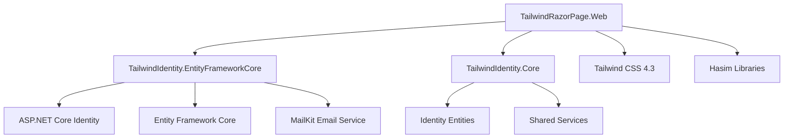

# TailwindRazorPage.Web


# Overview

`TailwindRazorPage.Web` is a modern ASP.NET Core Razor Pages application built with:

* ASP.NET Core 8
* Razor Pages
* Tailwind CSS 4.3 (with PostCSS)
* Entity Framework Core 8 (via `TailwindIdentity.EntityFrameworkCore`)
* ASP.NET Core Identity
* Hasim libraries for audit, dependency injection, and core functionality
* MailKit for email services

This project provides a complete starter template with custom Identity UI, legal pages, and a Tailwind CSS 4.3 pipeline.

---

# Architecture



---

# Features

## Authentication

Complete custom Identity experience with Razor Pages:

* Sign In (`/Account/SignInPage`)
* Sign Up (`/Account/SignUpPage`)
* Forgot Password (`/Account/PasswordForgot`)
* Reset Password (`/Account/ResetPassword`)
* Email Confirmation (`/Account/ConfirmEmail`, `/Account/SendConfirmation`)
* Two-Factor Authentication (`/Account/LoginWith2fa`)
* Lockout page (`/Account/Lockout`)

## Legal Pages

Static legal content pages:

* Conditions Générales d'Utilisation (`/Legal/CGU`)
* Conditions Générales de Vente (`/Legal/CGV`)
* Politique de Confidentialité (`/Legal/Confidentialite`)
* RGPD (`/Legal/RGPD`)

## UI & Styling

* Responsive layout with Tailwind CSS 4.3
* Clean authentication cards
* Modern form components with validation
* Mobile-friendly interface
* Legal footer links

---

# Project Structure

```
TailwindRazorPage.Web/

├── Areas/                       # Migrations EF Core
├── Pages/
│   ├── Account/                # Identity pages
│   ├── Legal/                  # Legal pages
│   ├── Shared/                 # Layouts & partials
│   ├── Index.cshtml            # Home page
│   ├── Error.cshtml            # Error page
│   ├── Privacy.cshtml          # Privacy page
│   ├── _ViewImports.cshtml
│   └── _ViewStart.cshtml
├── Persistence/
│   ├── DefaultContext.cs       # EF Core context (commented)
│   └── Models/                 # Entity models
├── Services/
│   ├── EmailOptions.cs
│   ├── IEmailService.cs
│   └── MailKitEmailSender.cs
├── Data/
│   └── DatabaseSeeder.cs       # DB seeding (commented)
├── wwwroot/
│   ├── css/
│   │   ├── app.css             # Tailwind source
│   │   └── style.css           # Compiled output
│   └── favicon.ico
├── Program.cs                  # App entry point
├── appsettings.json
├── appsettings.Development.json
├── package.json                # npm scripts & deps
├── package-lock.json
├── postcss.config.js
├── tailwind.extension.json
├── TailwindRazorPage.Web.csproj
└── PROSS.md
```

---

# Dependencies

## NuGet Packages

| Package | Version | Purpose |
|---------|---------|---------|
| `Hasim` | 0.1.3 | Core Hasim library |
| `Hasim.Core` | 0.1.0 | Hasim core functionality |
| `Hasim.EntityFrameworkCore` | 0.1.1 | EF Core integration |
| `Hasim.Injectify` | 0.1.2 | Dependency injection modules |
| `Hasim.Auditify` | 0.1.5 | Audit logging |
| `MailKit` | 4.17.0 | Email services |
| `Microsoft.AspNetCore.Components.WebAssembly` | 8.0.29 | WASM support |
| `Microsoft.AspNetCore.Components.WebAssembly.Authentication` | 8.0.29 | WASM auth |
| `Microsoft.AspNetCore.Identity.EntityFrameworkCore` | 8.0.29 | Identity with EF Core |
| `Microsoft.AspNetCore.Identity.UI` | 8.0.29 | Identity UI |
| `Microsoft.EntityFrameworkCore.SqlServer` | 8.0.29 | SQL Server provider |
| `Microsoft.EntityFrameworkCore.Tools` | 8.0.29 | EF Core tooling |
| `Microsoft.EntityFrameworkCore.Design` | 8.0.29 | EF Core design-time |

## Project References

```xml
<ProjectReference Include="..\TailwindIdentity.EntityFrameworkCore\TailwindIdentity.EntityFrameworkCore.csproj" />
```

The `TailwindIdentity.EntityFrameworkCore` project references `TailwindIdentity.Core` for shared Identity infrastructure.

## npm Dev Dependencies

| Package | Version | Purpose |
|---------|---------|---------|
| `@tailwindcss/cli` | ^4.3.3 | Tailwind CLI |
| `@tailwindcss/postcss` | ^4.3.3 | PostCSS plugin |
| `postcss` | ^8.5.23 | PostCSS |
| `postcss-cli` | ^11.0.1 | PostCSS CLI |
| `autoprefixer` | ^10.5.4 | CSS vendor prefixes |
| `esbuild` | ^0.28.1 | JS bundler |
| `lucide` | ^1.25.0 | Icon library |

---

# Tailwind CSS Pipeline

The frontend uses:

* Tailwind CSS 4.3 (native CSS variables, no config file needed)
* PostCSS for processing
* esbuild for JavaScript bundling

## Install Dependencies

```bash
npm install
```

## Development Mode (Watch)

```bash
npm run dev
```

Runs `postcss` in watch mode:
```
postcss wwwroot/css/app.css -o wwwroot/css/style.css --watch
```

## Production Build

```bash
npm run build
```

Compiles and minifies:
```
npx @tailwindcss/cli -i ./wwwroot/css/app.css -o ./wwwroot/css/style.css --minify
```

## JavaScript Bundling

```bash
npm run build:js
```

Bundles icons:
```
esbuild wwwroot/js/icons.js --bundle --outfile=wwwroot/js/icons.bundle.js
```

## Generated Files

```
wwwroot/
└── css/
    ├── app.css      # Source (Tailwind directives + custom CSS)
    └── style.css    # Compiled output (referenced in _Layout.cshtml)
```

The `Tailwind` MSBuild target in the `.csproj` runs `npm run css:build` before each .NET build.

---

# Database Setup

## Connection String

Default in `appsettings.json`:

```json
{
  "ConnectionStrings": {
    "DefaultConnection": "Server=localhost;Database=TailwindIdentity;Trusted_Connection=True;Encrypt=true;MultipleActiveResultSets=true;TrustServerCertificate=true"
  }
}
```

## Email Configuration

```json
{
  "Email": {
    "From": "noreply@tailwind.local",
    "SmtpHost": "localhost",
    "SmtpPort": 587,
    "SmtpUser": "",
    "SmtpPassword": ""
  }
}
```

## Identity Settings

```json
{
  "Identity": {
    "RequireConfirmedEmail": false
  }
}
```

## Apply Migrations

```bash
dotnet ef database update \
  -p ../TailwindIdentity.EntityFrameworkCore \
  -s .
```

## Create a Migration

```bash
dotnet ef migrations add MigrationName \
  -p ../TailwindIdentity.EntityFrameworkCore \
  -s .
```

The migrations are stored in `TailwindIdentity.EntityFrameworkCore/Migrations/`.

---

# Run Application

## Prerequisites

* .NET 8 SDK
* Node.js 18+ (for Tailwind CSS)
* SQL Server LocalDB or SQL Server instance

## Steps

1. **Restore .NET packages:**

```bash
dotnet restore
```

2. **Install npm dependencies:**

```bash
npm install
```

3. **Build CSS (one-time):**

```bash
npm run build
```

4. **Run database migrations:**

```bash
dotnet ef database update -p ../TailwindIdentity.EntityFrameworkCore -s .
```

5. **Start development:**

```bash
# Terminal 1 - CSS watch mode
npm run dev

# Terminal 2 - Run application
dotnet run
```

The application will be available at `https://localhost:5001` (or the configured port).

---

# Configuration

## appsettings.json

| Section | Description |
|---------|-------------|
| `ConnectionStrings.DefaultConnection` | SQL Server connection |
| `Email` | SMTP settings for MailKit |
| `Identity.RequireConfirmedEmail` | Require email confirmation for sign-in |
| `Logging` | Log levels |

## Program.cs Highlights

* Uses `AddTailwindIdentity()` extension from `TailwindIdentity.EntityFrameworkCore`
* Registers Injectify modules via `builder.InjectifyApplication()`
* Seeds database on startup via `DatabaseSeeder.SeedAsync()`
* Configures authentication/authorization middleware
* Maps Razor Pages

---

# Screenshots

Add screenshots to `docs/images/`:

```
docs/images/
├── razor-login.png
├── razor-register.png
├── razor-profile.png
└── legal-pages.png
```

Example usage:

```markdown

```

---

# Technology Stack

| Technology | Usage |
|------------|-------|
| ASP.NET Core 8 | Web framework |
| Razor Pages | UI architecture |
| Tailwind CSS 4.3 | Styling (native CSS variables) |
| PostCSS | CSS processing |
| esbuild | JavaScript bundling |
| Entity Framework Core 8 | Database access |
| ASP.NET Core Identity | Authentication |
| MailKit | Email services |
| Hasim | Core, Audit, Injectify libraries |

---

# Related Projects

| Project | Description |
|---------|-------------|
| `TailwindIdentity.Core` | Shared Identity entities & services |
| `TailwindIdentity.EntityFrameworkCore` | EF Core Identity implementation |
| `TailwindMvc.Web` | MVC template |
| `TailwindBlazor.Web` | Blazor template |
| `TailwindMaui.Web` | MAUI Hybrid template |

---

# License

MIT License